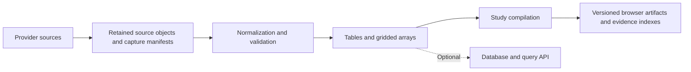

# Archive and processing options

[Study documents](README.md) · [Source rights and readiness](DATA-READINESS.md) · [National feasibility](NATIONAL-DATA-FEASIBILITY.md#architecture-and-reuse) · [Architecture consolidation](ARCHITECTURE-CONSOLIDATION.md)

**14 September 2026 — proposal for evaluation.** These are reusable options for transport, weather, power and other dated evidence. This document does not select a database vendor, provision infrastructure, start collection or establish permission to retain or publish any particular dataset.

## Starting position

For a bounded, recorded study, begin with an object archive, batch processing and small published artifacts. R2 is the proposed object store; Parquet is a candidate for tabular observations and schedules, and chunked arrays are a candidate for weather and other gridded fields. DuckDB can support transport analysis and compilation. Add a continuously available database when measured interactive or operational requirements justify one.

The [cost-control policy](COST-CONTROL.md) constrains these options to approximately **$100/month for the whole series**, with a proposed $60 operating envelope and $40 reserve. Public traffic must not trigger unrestricted paid work. Retention needs both an age limit and a shared byte ceiling; lower expected storage prices alone do not satisfy the requirement.

The archive preserves what the provider supplied. Normalized data makes it usable. The published study makes selected parts inexpensive to encounter. A query database can accelerate access without becoming the only surviving account of the evidence.

This supports the series' central commitment: an aggregate retains a path to its constituents. That path can use precomputed indexes and bounded evidence extracts; inspecting one service does not inherently require a database query on every click.

## Four responsibilities

| Responsibility | Candidate implementation | What it owns |
| --- | --- | --- |
| Source archive | R2 objects in original ZIP, GRIB, NetCDF, XML, JSON or other received format | Provider bytes, hashes, capture history and source/release context, retained only as permitted |
| Normalized analytical data | Partitioned Parquet for tables; chunked arrays such as Zarr for grids | Canonical observations, units, identities, quality flags, corrections and source-record references |
| Published study | Versioned manifests, aggregate tiles, time slices, group indexes and individual evidence extracts served directly as static assets | Bounded browser delivery and a reproducible composition tied to specific inputs and compiler versions; private R2 may retain build copies within the archive quota |
| Operational queries, if required | A relational/time-series database alongside the archive | Recent observations, indexes and frequently changing queries; rebuildable from the retained evidence within its permitted retention horizon |

Keep raw storage private unless the relevant source permits the intended public redistribution. A public study artifact has its own publication decision; moving bytes to another format or storage tier does not change the source's rights.

## Match the representation to the evidence

### Transport and other event tables

Parquet is a candidate for normalized bus positions, rail events, scheduled calls, aircraft or vessel reports, detector intervals and power-station readings. Partition by a useful combination of source, date and bounded time range; sort or index for the actual service, station and geographic queries. Avoid creating a separate small file for every vehicle or measurement. File and row-group sizes need a measured compromise between selective reads, request count and compilation throughput.

DuckDB can read Parquet from R2 through its S3-compatible interface. It runs on the processing host; storing files in R2 does not itself provide query compute. A compiler can use local staged files or remote reads according to measured performance. The [official R2 integration guide](https://duckdb.org/docs/lts/guides/network_cloud_storage/cloudflare_r2_import) documents this path.

Normalization must preserve the distinctions between scheduled, observed, predicted, estimated and reconstructed values. Store observation time separately from receipt time, retain operator/source namespaces and distinguish a vehicle from a dated service. Repeated last-known positions must not make a bus contribute repeatedly to an activity total. Deduplication should preserve links to the captures in which a sample appeared, along with conflicts and revisions, rather than erase that history.

Detector totals remain detector intervals: they cannot yield individual cars. A bird-density estimate likewise ends at its supported site, altitude and interval. One tabular format does not imply one motion model.

### Weather and other gridded fields

Weather commonly has time, horizontal position, variable and sometimes altitude dimensions. Chunked arrays fit requests such as “this region at this hour” or “these adjacent frames”. Zarr is one candidate: it defines compressed multidimensional chunks and metadata compatible with cloud object storage. [OGC Zarr specification](https://www.ogc.org/standards/zarr-storage-specification/)

Retain the provider files separately where permitted. An analysis-ready array must record coordinates/projection, units, time semantics, vertical levels, missing values, quality/support information and any regridding or interpolation. Forecast issue time and valid time are separate coordinates; a later run must not silently replace the forecast used in a preserved study.

Choose chunks around the queries. Regional animation benefits from spatial tiles containing a short run of frames; a long history at one location has a different access pattern. Smaller chunks reduce irrelevant bytes but increase requests and metadata work. The browser may consume a simpler compiled binary format while the analytical archive uses Zarr. The [shared field algorithms](SHARED-FIELDS.md) do not impose a storage format or establish that a Zarr pipeline is implemented.

### When a time-series database earns its place

A database is worth evaluating for concurrent, unpredictable requests over arriving data: the latest known state of many services, repeated geographic/time queries, joins between observations and service metadata, or aggregates that must change as corrections arrive. TimescaleDB is one candidate; its continuous aggregates maintain materialized time-series summaries incrementally. [Timescale documentation](https://www.tigerdata.com/learn/continuous-aggregates-timescaledb)

It is not yet a selection over ordinary PostgreSQL or another analytical/time-series engine. Benchmark the required filters, joins, late data, spatial access and query concurrency before choosing. For a dated artwork, compiling the national field and common groups once may meet the requirement with substantially less operational machinery.

If a database is introduced, give it a defined recent-data or working-set horizon and retain older evidence in the archive where allowed. Include database compute, indexes, backups, recovery and administration in the comparison. A small manifest or catalogue may be sufficient before a full query service is needed. No always-on database is required for the first bounded proof.

## Provenance, publication and retention

The source-specific findings belong in [data readiness](DATA-READINESS.md) and the edition's source record. Each archive policy should identify the provider/product, applicable licence or agreement and version, review date, and evidence supporting the intended uses. Account access, a successful download and an open-source software licence are separate from dataset permissions.

Record the following uses separately, with any conditions or unresolved limits:

| Use | What the source record must establish |
| --- | --- |
| Acquisition | Permitted endpoint, credentials boundary, request rate and geographic/product scope |
| Retention and processing | Allowed caching/archive duration, storage or processing restrictions, and permission for normalization and derived products |
| Reuse between editions | Whether the same retained source and its derivatives may support another work or audience |
| Public display | Applicable attribution, notices, limitations on representation and permitted access model |
| Redistribution | Whether original records, normalized extracts, aggregates or downloadable datasets may be shared, and under which onward conditions |
| Expiry or removal | What must be deleted, withdrawn or updated, including copies, indexes, extracts and dependent artifacts where the terms require it |

Use the recorded terms directly where they establish permission; a generic provider approval request is not an extra prerequisite. Unresolved rights for one use should remain explicit instead of being treated as either a blanket grant or a blanket prohibition on unrelated permitted work. Format conversion, aggregation and the software's MIT licence do not by themselves settle redistribution rights. Mixed-source artifacts carry the applicable obligations of their inputs.

Content-addressed objects should be immutable while retained: a correction creates a new object and capture entry. Immutability is not a promise of perpetual storage. Retention policies must permit required expiry or removal; object locks should only be used when consistent with that policy. If original evidence expires, mark the resulting limit on replay and inspection rather than leave a broken link presented as available raw data.

Every capture needs a source/product ID, sanitized endpoint, receipt time, provider timestamp or release ID where supplied, content hash, format/size and source-policy reference. Keep credentials and signed access URLs out of retained manifests. Every normalized partition needs its input hashes, schema and compiler versions, transformations, coverage and quality counts. Every published release needs a manifest linking those inputs to aggregate definitions, membership indexes, attribution and permitted evidence access.

An evidence extract should identify its source object and record/member locator and distinguish an original record from a normalized representation. This allows a small inspection response without requiring a phone to download an entire archive. If public raw access is not permitted, expose only the supported provenance and permitted representation, with the limitation stated honestly.

## Reuse across studies

One source acquisition can support London, Bristol and a national study where its terms allow that reuse. Each consumer should pin a source/data release and retain its own interpretation and geography. Reuse a durable archive through explicit manifests and artifact contracts, not by importing a sibling application's source or treating its mutable public deployment as the original source.

The existing [source-store and ground-transport modules](SHARED-GROUND-TRANSPORT.md), [All Change foundations](ALLCHANGE-FOUNDATIONS.md) and [field models](SHARED-FIELDS.md) supply parts of this path. Their availability does not mean a national R2 archive, Parquet/Zarr conversion or query service has been deployed. The Underfall national probe measured and discarded one response; its national collector mode is a starting point for a retained interval.

Share capture, integrity, manifest and processing mechanisms when their contracts are demonstrated across consumers. Keep provider credentials, source rights, retention choices and edition-specific interpretation explicit. This proposal does not require a new npm package or a universal schema for all sources.

## Cost model and limits

The following estimates compare data volumes, not permission to expand retention. Apply the [shared budget, traffic and retention controls](COST-CONTROL.md): initially propose a 30-day rolling window and at most 1,000 GB in R2 across all stored layers, including a finite allocation for selected study evidence. A year of retained data is a comparison case, not the default policy. Public delivery should use the direct static-asset path described there; public R2 reads would introduce visitor-dependent operation charges.

At the reviewed R2 Standard rate of **$0.015 per GB-month**, storage is inexpensive, but operations are billed separately: Class A is $4.50 per million and Class B is $0.36 per million. R2 lists free egress. Actual bills apply allowances, billing-unit rounding and GB-month accounting; the estimates below omit those adjustments. Recheck the [official pricing](https://developers.cloudflare.com/r2/pricing/) before provisioning.

| Illustrative material | Added per ordinary day | Monthly storage holding 30 days | Monthly storage holding 365 days |
| --- | ---: | ---: | ---: |
| Four hourly fields at 2 km over a 1,000 × 1,000 km crop | 0.096 GB | $0.04 | $0.53 |
| One five-minute rainfall field at 1 km over the same crop | 1.152 GB | $0.52 | $6.31 |
| National bus ZIPs, measured weekday hour projected | 6.7 GB | $3.02 | $36.70 |
| Detailed weather, rainfall and bus ZIPs together | 7.95 GB | $3.58 | $43.53 |

Weather figures are arithmetic for 32-bit scalar arrays, before compression, source files, metadata, missingness masks, extra levels and derived copies. They are not measurements of GRIB, NetCDF or Zarr artifacts. The bus figure projects the [recorded weekday hour of 14 September](NATIONAL-DATA-FEASIBILITY.md#specific-unresolved-acquisition-questions), 280 MB of archives, to 2,880 captures per day; an evening peak may exceed it. Different sources need their own acquisition budget.

**Measured on that hour, 14 September 2026.** Each archive expands to 30 MB and Underfall's normalised snapshot of it is about 15 MB of indented JSON, so snapshots are 1.8 GB per hour and about 43 GB per day: the snapshot contract is a Bristol-scale replay format, not the national normalised layer. Sixty-one percent of each capture's samples are new; deduplicating by operator, vehicle and observation time gives about two million distinct samples per hour, so a day is roughly 40 million rows before columnar compression. A year of raw archives, 2.4 TB, exceeds the whole storage ceiling, and the 250 GB selected-evidence allocation holds about 37 days of archives. The durable national layer is therefore the deduplicated table with capture references, with raw archives held for the rolling window and promoted only for selected days. The dated recorded day is the unit the budget allows and the unit the thesis wanted.

These are monthly charges for a fully populated retained window, not annual charges. A growing archive has a different average occupancy during its first month. Budget original objects, normalized data, public artifacts, temporary staging, database copies and backups separately; they coexist unless deliberately removed. Processing, request counts, source subscriptions and database services are additional. Benchmark object/chunk layout rather than assuming that the lowest byte count gives the lowest total cost.

## First implementation proof

Use one retained national bus hour and a small weather subset for the same interval, subject to their source policies. The proof should:

1. Retain permitted original objects and capture manifests, then replay without contacting the provider. Measure acquisition failures and observation ages independently.
2. Normalize transport records into a candidate Parquet layout and weather into candidate chunks. Verify sample identities, timestamps, missing values, corrections and input hashes.
3. Compile one national aggregate, one explicit group and one constituent/evidence lookup. Reconcile totals, preserve exclusion reasons and avoid double counting through a change of scale.
4. Measure compilation time and peak memory, retained bytes by layer, object/request counts, regional and individual lookup latency, and browser transfer/decoded memory. Exercise nearby seeks and a cold lookup, not just a fully cached replay.
5. Demonstrate a permitted retention expiry or removal using test fixtures, including dependent indexes and the visible evidence-availability state.
6. Prove cost admission under concurrent collection, oversized inputs, failed cleanup and exhausted job budgets. Check that public replay and constituent inspection do not invoke unbounded paid services; preserve the last compiled edition when new work pauses. Follow the [cost-control proof](COST-CONTROL.md#current-position-and-next-proof).

Static publication shapes the descent directly. The publisher allows 25 MiB per file and 20,000 files; a day of 40 million samples cannot ship, and 27,000 vehicles exceed the file count on their own. So the sea is aggregate tiles per time slice, the shoal is an index from tile to member services, and the fish are evidence packs grouped by operator or cell with an offset index, so that opening one bus fetches one small pack. Index to pack to offset, all static, with no compute on any selection.

**Run on 14 September 2026 against the recorded national hour** ([evidence](evidence/national-archive-proof-2026-09-14.json); Underfall `data:bus:proof`), steps 1 to 4 of the six, on the author's Mac with DuckDB in process:

1. *Replay.* All 120 retained archives, 280 MB, were replayed from the immutable objects without the provider: 3,246,269 reports, decoded and staged as 120 MB of gzipped NDJSON in 146 seconds.
2. *Normalise.* Deduplicating by operator, vehicle and observation time gave 2,000,059 samples from 27,111 vehicles and 365 operators, each carrying the captures it appeared in; zero position conflicts, 9,831 samples outside Great Britain, 7 reported ahead of receipt, 397,515 without a dated journey reference. DuckDB ingested, deduplicated and wrote in about 1.3 seconds. The samples Parquet is 25.8 MB, about 13 bytes per sample, so a day is roughly 600 MB against 43 GB of snapshots. Peak memory was 6.4 GB with the reports table in memory, so a day is normalised per hour or through an on-disk database.
3. *Compile and reconcile.* Five-minute, 0.1° tiles: about 1,550 cells per slice, 164,000 samples and 20,800 distinct vehicles. Samples reconcile exactly between tiles and the direct total in every slice. Distinct vehicles per cell overcount the slice's distinct vehicles by about 3,200, fifteen percent, because vehicles cross cell boundaries within five minutes; the aggregate measure is therefore samples, or a vehicle assigned to one cell per slice, never a sum of per-cell vehicle counts. The archive also carried 125,325 stale samples in 265 slices before the recording began, last-known positions up to a day old, which the compiler reports and excludes from the window. The busiest cell at 12:30, central London, had 847 members and 4,340 samples, and its membership reconciled with the tile. One member's 71 samples were read cold from Parquet in 2 to 3 milliseconds.
4. *Publication shapes.* One JSON per slice is about 55 KB in the window. One gzipped evidence pack per operator totals 18 MB for the hour; the largest, TfL, is 3.2 MB compressed for 7,682 vehicles. Projected to a day, TfL alone exceeds the 25 MiB per-file limit at 78 MB; only two operators exceed 12 MiB and 136 produce under 64 KB. Packs are therefore **one per operator per day, split at 20 MiB where needed**, which is TfL into four parts: about 369 packs plus 288 slices and a few indexes, roughly 660 files and 450 MB per published day. Per-operator-per-hour packing would multiply that by fourteen to solve a problem only TfL has.

Step 5 has begun: an [experimental bucket](COST-CONTROL.md#current-position-and-next-proof) exists with a 30-day rule on the rolling prefix and a one-day rule on a test prefix, the hour's Parquet layer is uploaded and round-trips byte-identical, and a probe awaits expiry. Step 6, cost admission, is partly proved by Underfall's [capacity ledger](COST-CONTROL.md#current-position-and-next-proof): reservation before write, commit after, release on failure, concurrent admission exactly to the cap, and pause on inventory disagreement; the bucket-listing maintenance job and expiry-driven retirement remain. The national collector can now retain archives only, which the proof showed to be the durable form. **Hourly normalisation, 14 September 2026.** The proof's whole-hour, in-memory pass became an hourly partitioner in Underfall: each complete receipt hour of a journal is staged from the retained archives and written as `samples/date=D/hour=HH/part-0.parquet` with the hour's captures beside it and a manifest of input hashes, counts, sizes and timings; done hours are skipped and incomplete ones wait. On the recorded hour it wrote the 11:42–12:00 partial as 8.6 MB from 605,313 samples in 45 seconds and the 12:00–12:42 partial as 18.4 MB from 1,407,202 samples in 105 seconds. A loop runs it every five minutes on the recording host against the newest journal, so a day's Parquet accumulates while it records, and the compilers read the union of partitions.

**The recorded feeds normalise the same way.** TfL arrival predictions, cycle-hire dock states and Swiss edge trip updates each have an hourly normaliser writing per-table Parquet partitions with a manifest. Their evidence kinds differ and the tables say so: a prediction or a stop-time update is a forecast that gets revised, so a revision is identified by its generation time and kept once with the captures it appeared in; a dock state is an observation, kept per capture with a derived change table. Loops for all three run on the recording host from 14 September, waiting for their journals.

The decision this run supports: the deduplicated Parquet table with capture references is the durable national layer; archives are held for the rolling window; the published descent is slices, tile-to-member indexes and per-operator-per-day packs, all static.

**Publishing limits, checked 14 September 2026.** Workers Static Assets allow 20,000 files per Worker version on the Free plan and 100,000 on Paid, 25 MiB per file with no stated total; an account may hold 100 Workers on Free and 500 on Paid. At 660 files a day, one Worker version holds 30 published days on Free and 150 on Paid. The account also carries the existing edition and service Workers, so a Worker per published day would meet the account limit within a hundred days. The adopted shape is **one Worker per edition holding its published day set under path prefixes**, republished as days are added or retired, so that a viewer moving between days stays inside one deployment and the binding limit is files per version, not Workers. The number of published days is in any case bounded first by the 250 GB selected-evidence allocation, about 32 complete days, and by curation.

Use those results to choose partition/chunk sizes and decide whether static indexes suffice. Expand retention, add sources or introduce an operational database when the measured workload, source permissions and shared operating allowance support it. A shared archive is a candidate infrastructure relationship; each work retains its own artistic argument.
