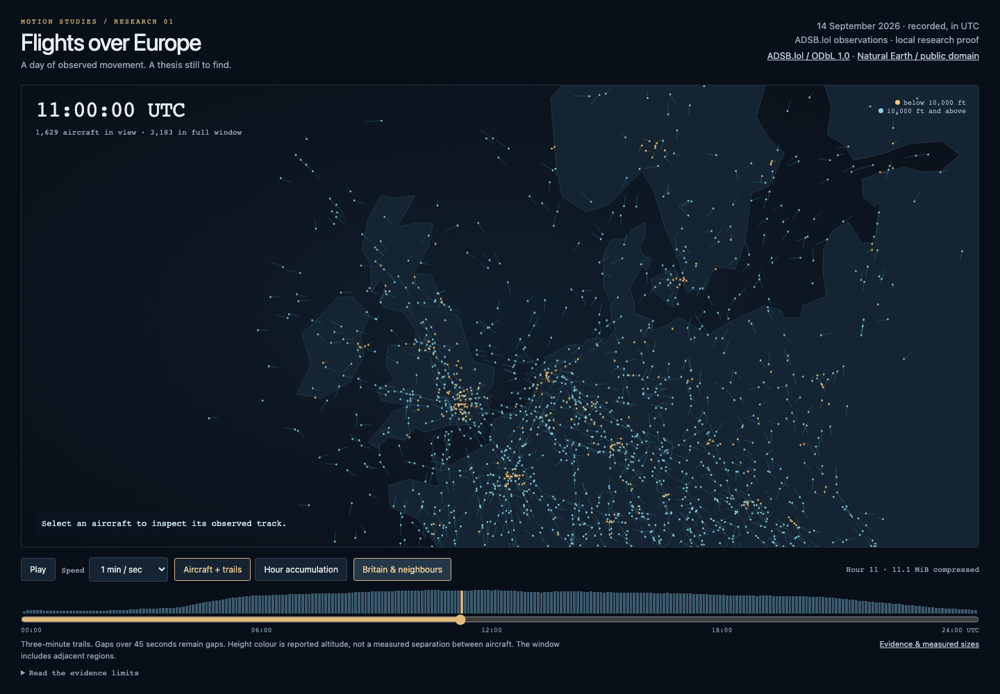

# Flights over Europe — first recorded proof

**16 September 2026 · Recorded day: 14 September 2026 · Local research, unnumbered**

[Research question and candidate theses](EUROPE-AIR-RESEARCH.md) · [Measured evidence](evidence/europe-air-proof-2026-09-14.json)

One complete UTC day has been acquired, compiled and replayed in a local browser. The result supports the practical feasibility of a wider-area recorded study. It also provides material for choosing a thesis, without establishing that a recurring pattern or a finished work has been found.

## What was made

The review offers a 24-hour clock, moving aircraft with three-minute trails, selection of an individual aircraft, a Britain-and-neighbours view, and a separate hourly observation-density view. A small day chart shows distinct observed aircraft at five-minute instants across the full window. Both visual modes use the same retained observations.



The geographic selection is **25°W–45°E, 34°N–72°N**: a viewing rectangle containing Iceland, Britain and much of continental Europe, plus adjacent areas. It is not a political Europe mask. The basemap is pinned Natural Earth 1:110m land, public domain. A simple fixed-scale equirectangular projection is sufficient for this first inspection; it does not establish the final cartography.

The review is local at **<http://127.0.0.1:4187/>** while its server is running. It is not deployed or added to the catalogue. Source files and generated review files are ignored under `work/europe-air-proof/2026-09-14/` in the Motion Studies checkout. The retained scripts, this note and the compact evidence record make the method inspectable without committing the bulk data.

## Measured result

Values below use decimal MB/GB unless explicitly labelled MiB/GiB. Source bytes are response-body bytes after HTTP content decoding; retained bytes are measured after source-store compression. They are not network-transfer measurements.

| Measurement | Result |
| --- | ---: |
| Historical half-hour slices | 48 of 48 |
| Source frames | 8,640; every ten seconds from 00:00:00 to 23:59:50 UTC |
| Missing or duplicate source frames | 0 |
| Source response bodies | 1,045,852,080 bytes / 1.046 GB |
| Retained aircraft source objects | 926,199,740 bytes / 926 MB |
| Retained observations in the viewing window | 12,660,904, excluding chunk overlap |
| Distinct retained ICAO aircraft addresses | 10,095; not a flight count |
| Highest five-minute aircraft-presence snapshot | 3,278 at 11:30 UTC |
| Hourly replay files combined | 185,155,012 bytes compressed / 508,792,267 decoded |
| Largest replay hour | 11:00–12:00: 11.65 MB compressed / 32.03 MB decoded |
| Initial acquisition, including the pinned basemap | 206.9 seconds |
| Sum of hourly compilation times | 45.1 seconds, excluding process startup and final verification |
| Largest compiler child-process resident memory | 812,784 KiB / 793.7 MiB |

The retained aircraft sources plus compressed replay files occupy about **1.11 GB** for this day, before manifests, screenshots and other working files. Thirty equivalent days would be about **33.3 GB**, and ninety about **100 GB**, for these two layers. These are projections from one measured day, not an allocated retention window or a claim about seasonal maxima. Full per-aircraft trace archives are a different source product and were not downloaded.

Compilation runs in serial hourly child processes with a 2 GiB JavaScript heap ceiling. Each reads its hour plus a 180-second preceding and 45-second following overlap, bounded to the retained UTC day. Peak memory was measured separately from that heap ceiling. No full-day array of aircraft samples is constructed.

## What completeness means here

All expected source time frames are present. **That does not mean all aircraft were received or that every trajectory is continuous.** This is an archive-continuity result, not a receiver-coverage audit or a census of flights.

The compiler uses the shared ADS-B decoder and transport thresholds, with additional conservative continuity rules. Conflicting same-time positions are excluded. Gaps over 45 seconds, implied position jumps above 1,200 knots and known callsign changes break fragments. These rules prevent the renderer joining unrelated or unobserved stretches. Four or more samples and the shared altitude/speed criteria are required for a retained fragment.

The hour audits count 67,126 gap barriers and 3,618 jump barriers across their working windows, including repeated boundary overlap. Those are diagnostic counts, not distinct flights, aircraft or proven receiver failures. No duplicate observations, conflicting same-time positions or invalid coordinates were encountered by this stage. The source decoder has already excluded ground/negative-speed and non-ICAO records; the result does not describe everything in the source.

Transport filtering is applied to continuous fragments separately in each hourly working window. This makes the experiment bounded, but its segmentation and eligibility can differ from the original whole-day compiler. Fragment IDs are not stable flight identities across chunks; selection follows the aircraft address. The first and last minutes lack observations from adjacent dates. Published study ingestion should resolve these boundary policies deliberately.

No origin, destination, arrival/departure classification, passenger count or airline schedule is inferred. The accumulation view counts observations in 0.5° cells, with brightness scaled independently within each hour. It is a way to inspect sampled paths; it cannot compare absolute activity between hours or establish published airways. Gaps and reception differences remain possible explanations for sparse areas.

## Browser checks

The local review was checked in headless Chromium 153 and WebKit 26.6 on the author's laptop, with desktop and 390 × 844 phone-layout viewports respectively. The phone-sized run is not a physical-phone benchmark. Transfers were over localhost without throttling.

At 11:00 UTC the rendered count of 3,183 aircraft reconciled with the compiled instant count. The checks also covered playback, pause, seeking to midnight and the end of day, hour rollover, the regional and accumulation views, a maximum two-hour cache, missing-file failure, horizontal overflow and JavaScript errors. The screenshots were inspected at both sizes.

| Measurement | Chromium desktop | WebKit phone layout on laptop |
| --- | ---: | ---: |
| Median measured map draw | 4.0 ms | 8 ms |
| 95th-percentile measured map draw | 4.7 ms | 10 ms |
| 95th-percentile animation-frame interval | 16.8 ms | 17 ms |
| Busiest-hour load, hash verification, inflate and parse | 159 ms | 120 ms |
| Reported JavaScript heap after two loaded hours | 188 MB | Not available |

The viewer deliberately redraws at roughly 30 Hz; animation-frame intervals describe the browser callback, not the map's drawing frequency. These short, local measurements show that the representation is useful for research. They do not establish public delivery or mobile memory budgets. An 11.65 MB compressed hour remains a large opening download; smaller time chunks, spatial selection and/or a carefully validated overview representation are sensible next experiments.

The busiest hour was rebuilt offline from the retained source objects and produced byte-identical compressed output. All 24 chunk hashes were checked, and both temporal-bin totals and spatial-cell totals reconciled with each hour's retained sample total. Four focused tests cover long gaps, conflicting timestamps, implausible jumps and source-frame gaps.

**Playback follow-up, 16 September:** the author reported loading flashes at 15 simulated minutes per second, when each hour lasts four seconds. The review now prefetches the next hour and reuses that pending request at the boundary, retaining at most the current and next hour in its cache. A late response holds the last valid frame and clock with a small buffering status; a failed response pauses playback with an unavailable status. Chromium and WebKit checks crossed successive hours at the fastest speed with no loading overlays, empty frames or duplicate hour requests, and separately verified delayed and failed loads. These functional results are retained in the evidence record; the performance figures above remain the original pre-prefetch measurements.

## Cutover isolation

Before starting, the current [MiniMax cutover checkpoint](RECORDER-CUTOVER-2026-09-16.md) and its task were read. The new deployment was staged while legacy recording remained active, with an overnight migration planned.

This experiment therefore ran entirely on the author laptop, in its own ignored directory. It made no SSH connection to the mini and changed no recorder checkout, feed store, ledger, schedule, LaunchAgent, migration file or R2 object. Its manual acquisition has a separate 8 GiB directory ceiling and a 12 GiB physical free-space floor. Each source response is capped at 64 MiB, with at most one retry; the commands are intended for one owner at a time. A preliminary request for an unpadded filename returned 404 before the verified, zero-padded 48-slice acquisition began.

The scripts are a research harness in Motion Studies, not a new operational provider integration. After cutover validation, the source acquisition and normalized evidence handoff can be adapted into the recorder under its shared admission, inventory and retention mechanisms. The local proof is already useful without making that change. The new disk's capacity is not silently treated as an aircraft allocation.

## First visual reading

**Author response, 16 September:** the zoomed-out Europe-wide view is particularly interesting because hotspots such as London and Paris become visible within the larger field. This makes the emergence of familiar places at continental scale a leading composition prompt. Keep the wide view central while testing how those concentrations form, persist and change; the thesis remains open.

The Britain view offers a complementary inspection: the moving field continues across the Channel and North Sea, while lower-altitude clusters bring familiar places into focus. It can provide a closer look within the continental composition. Neither view yet establishes airport endpoints or explains why a hotspot exists.

This is an editorial reading of the first images, not proof of endpoints, purposeful connections or a recurring daily rhythm. The full-window presence chart rises strongly during the morning and stays elevated across much of the day, but one Monday cannot establish a typical European day. The contrast between short moving trails and accumulated observations is worth exploring further: the first preserves individual journeys; the second exposes repeated occupancy while making reception bias easier to overlook.

The practical question has advanced from estimated feasibility to a measured, inspectable day. The thesis remains open. The next useful comparison would be another weekday and a weekend day, acquired as explicit bounded jobs after reviewing this composition and the recorder cutover. No further days or continuous collection have been scheduled by this proof.

## Reproduce or reopen

From the Motion Studies checkout, with Node 24 or later and the repository dependencies installed:

```sh
# First acquisition, or verified cache reuse. This harness is fixed to 14 September.
node scripts/research/europe-air-proof.mjs acquire

# Offline compilation and reconciliation; no network access.
node scripts/research/europe-air-proof.mjs compile

# Local preview; serves only the compiled review directory.
python3 -m http.server 4187 --bind 127.0.0.1 --directory work/europe-air-proof/2026-09-14/review
```

In another terminal, while the preview is running:

```sh
npx vitest run scripts/research/europe-air-proof.test.mjs
node scripts/research/check-europe-air-review.mjs
node scripts/research/check-europe-air-streaming.mjs
```

The acquisition retains public source URLs, retrieval times, exact input hashes, compressed storage sizes and attribution. The [checked-in evidence](evidence/europe-air-proof-2026-09-14.json) includes those identities, hourly output hashes, method and resource limits, reconciliation counts and browser results. Raw aircraft observations remain in the ignored local source store; public source availability may change, so future reproduction should prefer those retained objects.
